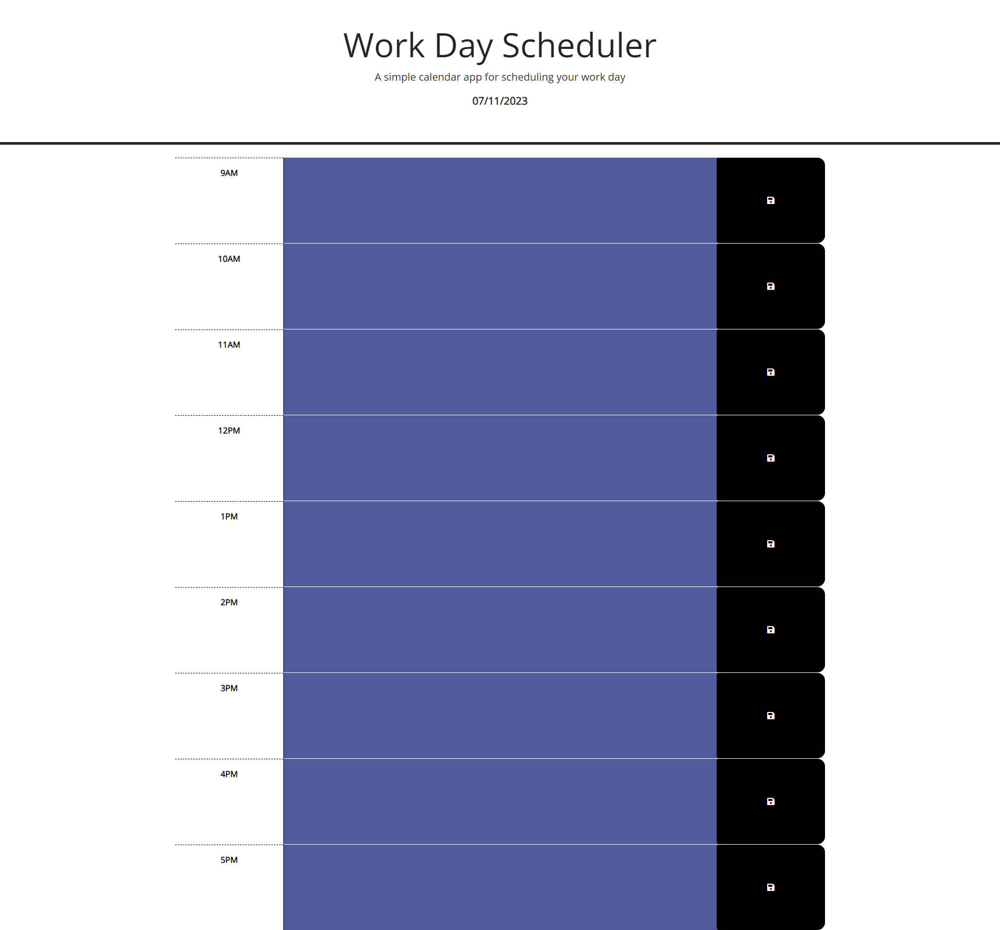
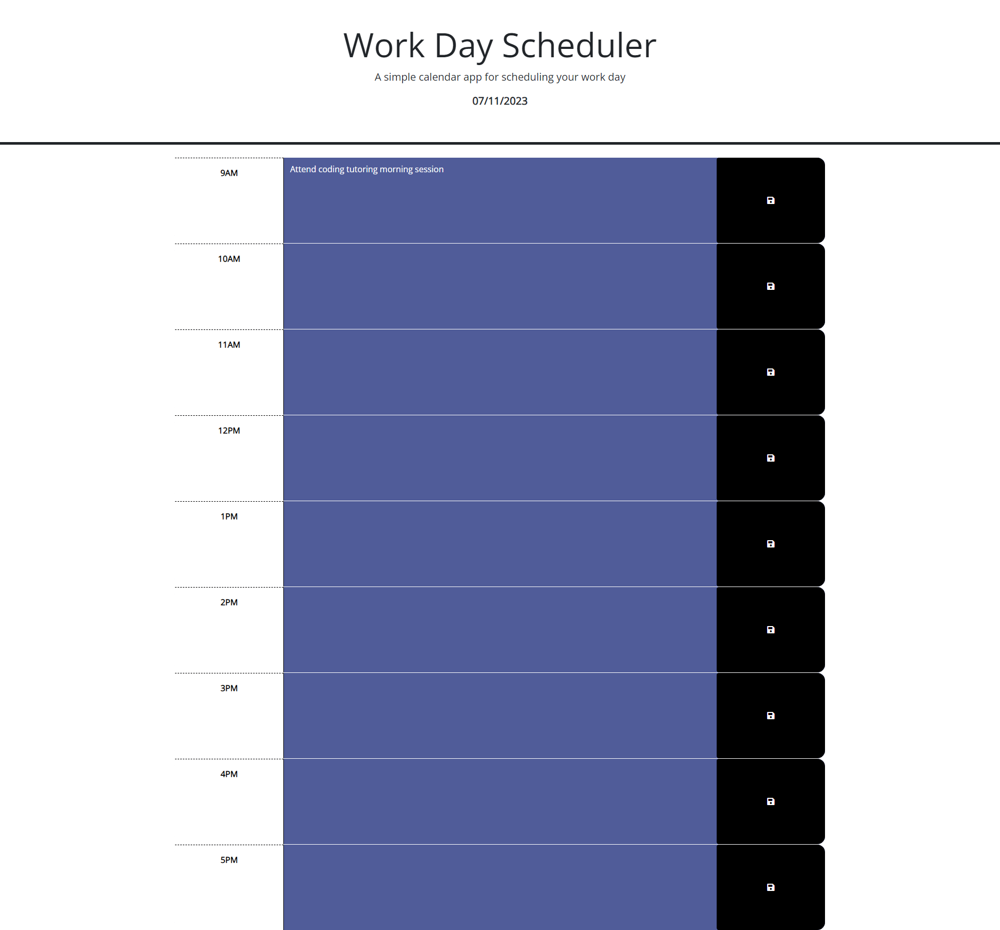
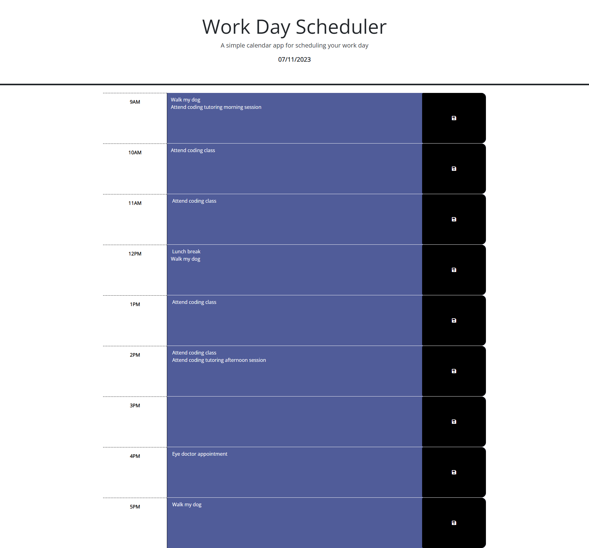
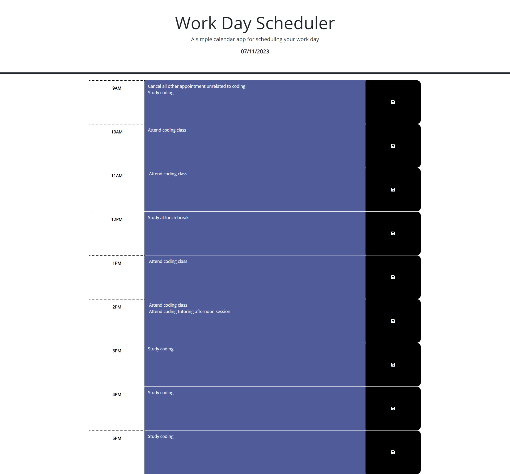
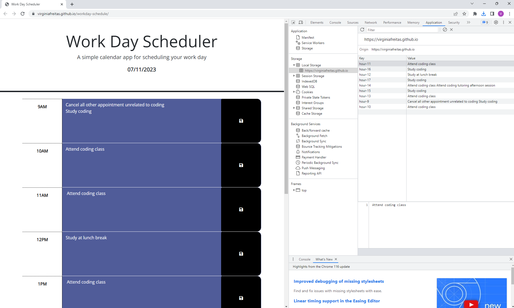

<!-- // READ ME IN PROGRESS - REFERENCE COPIED FROM PREVIOUS PROBLEM -->

# code-quiz

## Description

    The objective of this project is to create an interactive web page that offers a coding quiz, providing users with an engaging and challenging experience. The quiz will include a timed multiple-choice questionnaire, enriched with interactive coding challenges. By storing high scores, the aim is to enable users to measure their progress against their peers. When the user clicks the start button, a timer begins, and they are presented with a question. Upon answering a question, another question appears. If a question is answered incorrectly, time is deducted from the clock. The game ends when all questions are answered or the timer runs out. At the end of the game, users can save their initials and score. The web page is designed to run smoothly in a browser, featuring dynamically updated HTML and CSS elements driven by custom JavaScript code. The user interface is clean, polished, and responsive, ensuring an enjoyable experience. The primary goals of this project are to improve proficiency in JavaScript and web APIs while gaining familiarity with commonly used assessment formats in interviews.

## Installation

1. Created HTML file and CSS templates, to be adjusted as the code is written.
2. Created the Javascript file.
3. Create global variables: set initial score, sets initial timer count, sets array of strings with all quiz questions, sets arrays of strings with all possible answer for each question, sets array with the index number of all the correct answers, sets the index number of current question, starting at zero
4. Create functions: startTimer, nextQuestion, checkAnswer, showQuestion, disableOptions, showNextButton, show Result,
5. Created event listener for the start button

## Usage

1. Open the following URL in the browser: https://virginiafreitas.github.io/code-quiz/
2. Click on the "Start Quiz" button.
3. The timer will start to run and user will have 120 seconds to answer all the questions.
4. User selects the alternatives that are believed to be corrected, for all the 6 questions.
5. User press the "Next Question" button.
6. An alert will pop up informing the user if that answer is correct or wront.
7. After 6 questions answered, the user types the initials.
8. The score will be displayed.

 

 

 

 

 

## Credits

I have received advice from the UC Berkeley Extension tutors Henry Weigand on pseudocoding and Dennis Itua and Kyle Vance on developing the code.
I reached out to the Mozilla Developer webpage to learn how to use some of the functions. ( https://developer.mozilla.org/en-US/ )
I reached out to the Day.js webpage to learn how to use the tool. ( https://day.js.org/en/ )

## License

    MIT License